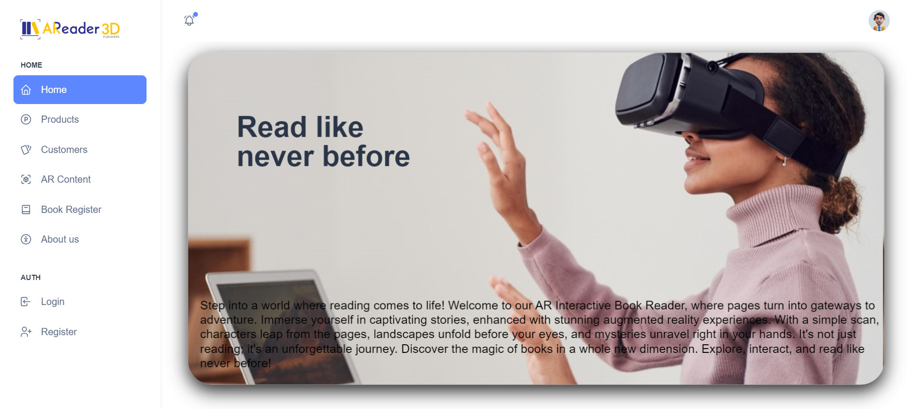

# Interactive Book Reader - Frontend

## Project Overview

This repository contains the frontend code for the Interactive Book Reader project. Interactive Book Reader is a web and mobile application that revolutionizes the reading experience by seamlessly integrating Augmented Reality (AR) content into books. Readers can access an extensive library of books, read traditionally, or engage with AR features to bring characters and scenarios to life. The platform also includes features like text-to-speech conversion, dictionary integration, highlighting, and bookmarking to enhance the reading and learning experience.

## Technologies Used

- **React**: The frontend is built using the React JavaScript library, which allows for the creation of dynamic and interactive user interfaces.

- **React Native**: For the mobile application, React Native is used to enable cross-platform development, allowing us to target both iOS and Android devices.

## Getting Started

To set up and run the Interactive Book Reader frontend on your local machine, follow these steps:

1. Clone this repository to your local machine using `git clone`.

2. Navigate to the project directory: `cd interactive-book-reader-frontend`.

3. Install project dependencies by running: `npm install`.

4. Start the development server: `npm start`.

5. Open your browser and access the application at [http://localhost:3000](http://localhost:3000).

## Project Structure

The project structure is organized for scalability and maintainability:

- **src**: Contains the main source code for the React application.

  - **components**: Reusable UI components.

  - **containers**: Components that manage data and behavior.

  - **pages**: Top-level components representing pages or views.

  - **assets**: Static assets such as images, styles, and fonts.

  - **api**: API configuration and utility functions.

- **public**: Publicly accessible files, including the HTML template.

## Getting Started

To get started with the AReader web application, follow these steps:

1. Visit the application at [AReader Web App](https://interactive-book-reader.web.app).

2. Create an account or log in to your existing account.

## Acknowledgments

We would like to express our gratitude to the open-source community and the contributors who have helped make this project possible.

